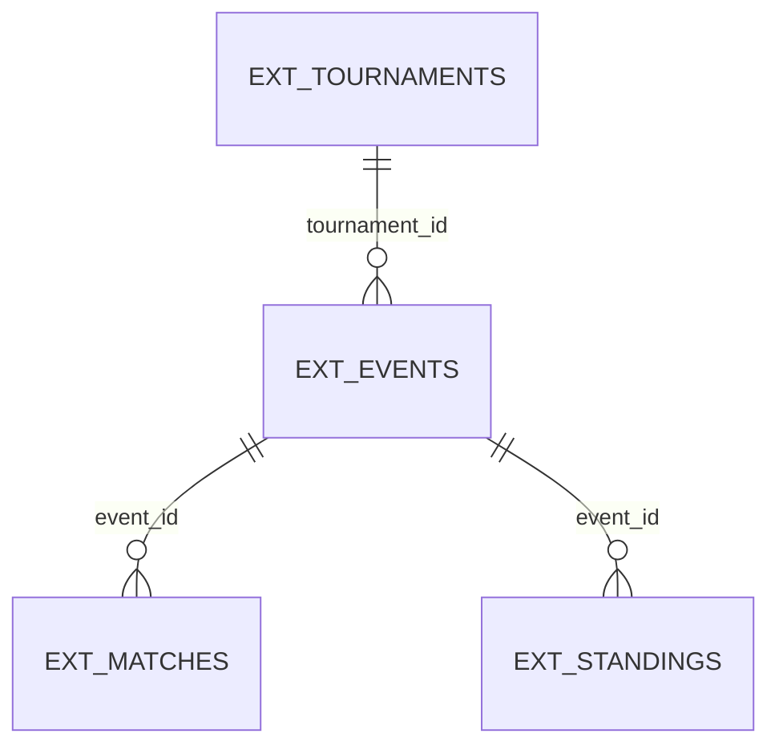
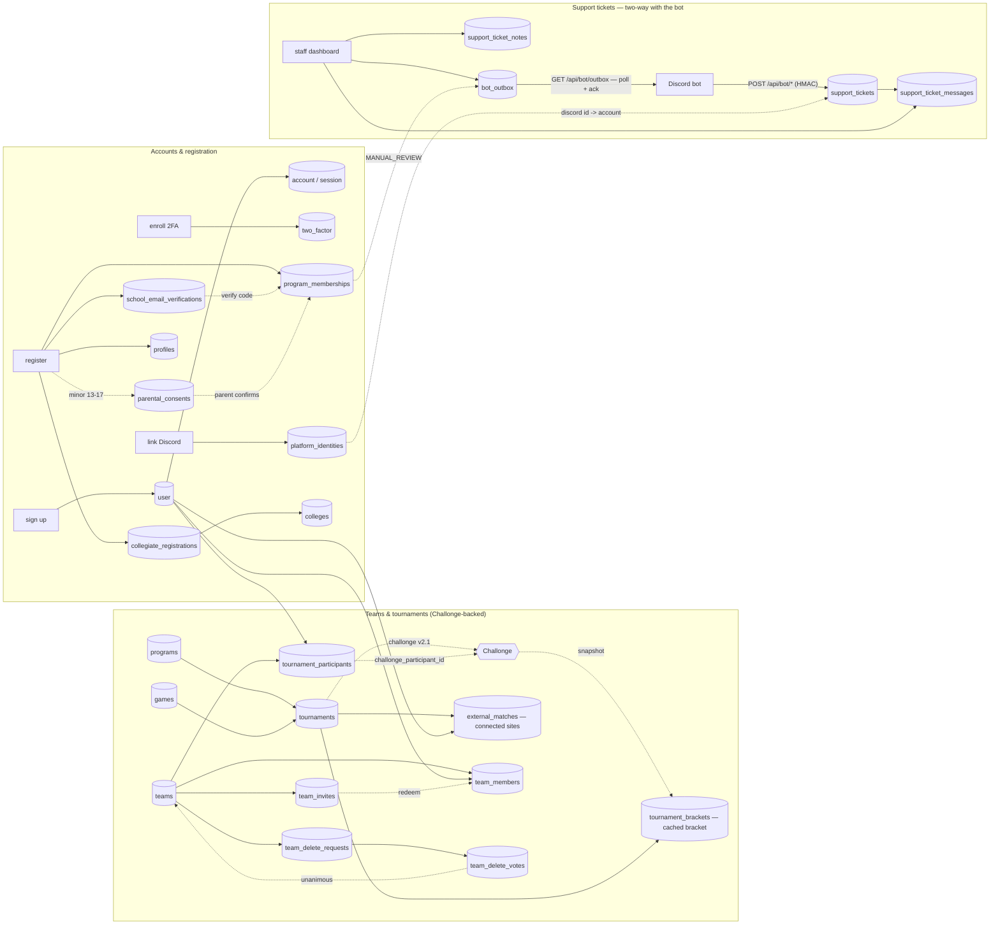

# website-sql

The Fault Foundation — application database (Cloudflare **D1 / SQLite**).

A single relational database behind the Next.js site: accounts and two-factor
enrollment, collegiate membership & school-email verification, parental consent
for minors, connected platform identities (Discord / Battle.net / Steam), staff
access & moderation, teams with invites and multi-manager deletion, matchmaking
(LFG/LFM), a **Challonge-backed tournament system** (Challonge runs the bracket;
D1 holds identity, sign-ups and a cached render), and the **support-ticket
system mirrored two-way with the Discord bot**. It is
built on a **stable identity core** with **per-program satellite tables** —
adding a new program is a new table, never a change to `user`.

> **Second database:** external (start.gg/FACEIT) tournaments live in a separate
> D1, **`cen-sql`** ([db/cen-schema.ts](cen-schema.ts), migrations in
> `drizzle-cen/`), bound read-only to the Commons as `CEN` and joined to this
> one only in application code. It's documented in the root `CLAUDE.md`
> ("External tournaments — the second D1"); everything below is `website-sql`.

## `cen-sql` projection

`cen-sql` is a separately migrated, read-only projection of public data written
by the sibling `cen-news-notifications` scraper. The Commons never writes it.

| Feature | Relation | Shape |
|---|---|---|
| External tournament catalog | `ext_tournaments` | Source id, name/game, start/end window, location, native URL, `banner_url` (cover art) + `description` (blurb) for the branded tile/detail hero |
| Provider bracket/event | `ext_events` | Tournament parent, provider event id/state, entrant count |
| Public match calendar + bracket | `ext_matches` | Event parent, provider match id, optional schedule/state/round, `round_order` (signed: +winners/−losers, for column order) + `order_key` (within-round bracket position), two entrant labels + `entrant_1_score`/`entrant_2_score`, `winner` (1/2/null), `prereq_1_id`/`prereq_2_id` (source match id feeding each slot — the feed graph for connectors), native match-page URL |
| Final results | `ext_standings` | Event parent, entrant label/type and placement |

`ext_matches.scheduled_at` is nullable by design: start.gg often leaves a
pending set's `startedAt` empty. FACEIT rarely stamps an individual match, but
the scraper backfills each match from its championship's per-round `schedule`
(round → date), so most FACEIT matches carry an approximate round-level time
instead of none; genuinely-undated rows still render under **Date TBD** rather
than inventing a time. `banner_url` comes from FACEIT (the championship
`cover_image`, else the **organizer's** cover/avatar — most championships leave
their own image empty even when the site shows the organizer's banner) or
start.gg's banner image; `description` comes from the FACEIT championship blurb
or start.gg's `rules` field (the organizer's about/details text). The branded
bracket view reads `round_order`/`order_key` to lay matches out in columns
top-to-bottom, `prereq_1_id`/`prereq_2_id` (the source match feeding each slot)
to draw exact feed-forward connectors within a bracket, `entrant_*_score` +
`winner` to show scores beside each name with the winner highlighted, and `url`
as a deep link to that match's own result page (a start.gg set URL / a FACEIT
match room). All ids are deterministic strings from
provider lineage, so projection imports upsert the same logical rows.

Relational form:

```text
EXT_TOURNAMENTS(*id, source, source_tournament_id, name, slug, game,
                start_at?, end_at?, num_attendees?, city?, country?, url?,
                banner_url?, description?)
EXT_EVENTS(*id, tournament_id→EXT_TOURNAMENTS, source_event_id, name?, state?,
           num_entrants?)
EXT_MATCHES(*id, event_id→EXT_EVENTS, source_match_id, scheduled_at?, state?,
            round?, round_order?, order_key?, entrant_1_name?, entrant_2_name?,
            entrant_1_score?, entrant_2_score?, winner?, prereq_1_id?,
            prereq_2_id?, url?)
EXT_STANDINGS(*id, event_id→EXT_EVENTS, entrant_name, is_team, placement?)
```



Its schema is [db/cen-schema.ts](cen-schema.ts), migrations live in
[`drizzle-cen/`](../drizzle-cen), and local/remote migration commands are the
`npm run db:cen:*` scripts. A generated seed imports public rows through
[`scripts/cen-project.mjs`](../scripts/cen-project.mjs).

The live writer, its sync-state table, provider credentials, migrations, and
Cloudflare Cron configuration are owned by the separate
`cen-news-notifications` repository. Commons keeps this schema only as the
read-side contract used by Drizzle.

The source of truth is the Drizzle schema in [`db/schema.ts`](schema.ts). SQL
migrations are generated by `drizzle-kit` into [`drizzle/`](../drizzle) and
**applied by Wrangler** (which tracks applied migrations in a `d1_migrations`
table); the running app reads D1 per-request through Drizzle (`lib/db.ts`).
Better Auth owns the `user` / `session` / `account` / `verification` /
`two_factor` table shapes.

> **Keep this file in step with the schema.** Every `db/schema.ts` change ships
> with the matching edit here — the feature→schema mapping, the relational form,
> and the graphs below are all hand-maintained and drift silently otherwise. A
> migration in `drizzle/` with no README edit is an incomplete change.

## Setup

Prerequisites: Node 20+, npm. Wrangler ships as a dev dependency. A Cloudflare D1
database is bound in [`wrangler.jsonc`](../wrangler.jsonc) as `DB`:

```jsonc
"d1_databases": [
  { "binding": "DB", "database_name": "website-sql",
    "database_id": "…", "migrations_dir": "drizzle" }
]
```

Runtime secrets live in `.dev.vars` locally / `wrangler secret put` in
production (none are needed just to build or migrate the schema). See
[`.dev.vars.example`](../.dev.vars.example) and [`types/env.d.ts`](../types/env.d.ts)
for the full list with reasoning; the ones that touch data in this database:

```
BETTER_AUTH_SECRET=          # session signing — ALSO encrypts two_factor.secret
                             # and backup_codes: rotating it makes every enrolled
                             # member's 2FA undecryptable, with no reset path
DISCORD_CLIENT_ID=           # Discord OAuth (optional; enables "Sign in with Discord")
DISCORD_CLIENT_SECRET=
DISCORD_STAFF_ROLE_MAP=      # JSON {roleSnowflake: staffRole} -> staff_roles rows
                             # with granted_via = "discord"
BATTLENET_CLIENT_ID=         # Battle.net linking -> platform_identities
BATTLENET_CLIENT_SECRET=
SUPPORT_EMAIL_APP_PASSWORD=  # SMTP app password for school-email codes, account
                             # verification links, 2FA codes and parental-consent
                             # links (omit and the body is logged to the terminal)
BOT_API_SECRET=              # shared with the Discord bot; gates the ticket
                             # bridge (app/api/bot/*) and the bot_outbox queue
```

## Schema, migrations & seeding

```bash
npm run db:generate         # db/schema.ts change -> new SQL file in drizzle/
npm run db:migrate:local    # apply to the local D1 (.wrangler/state)
npm run db:migrate:remote   # apply to the real D1 (run before `npm run deploy`)

npm run db:seed:generate    # regenerate db/seed/schools.sql from the upstream dataset
npm run db:seed:local       # load the ~10k-row university directory
npm run db:seed:remote

# registry rows the app references by stable id (games/programs):
wrangler d1 execute website-sql --local  --file=db/seed/bootstrap.sql
wrangler d1 execute website-sql --remote --file=db/seed/bootstrap.sql

# bootstrap the first staff owner (you must be staff to grant staff):
npm run staff:seed -- --email you@example.com     # add --remote to seed production
```

### One-time legacy bot import

[`scripts/migrate-legacy-bot-data.mjs`](../scripts/migrate-legacy-bot-data.mjs)
maps a sanitized JSON export of the former bot datastore into the existing
identity, registration, platform-identity and support-ticket tables. It is
local-only, deterministic and idempotent: it backs up `.wrangler/state/v3/d1`
before `--apply`, refuses a remote target, and aborts when an email, provider
account, profile, platform identity, college, membership, registration or ticket
is already owned by a different row.

The import is intentionally normalized rather than archival. `VERIFIED` stays
verified; another lifecycle state receives `MANUAL_REVIEW` only when application
data exists; identity-only join/leave rows get no invented membership. It never
imports plaintext verification codes, attempts, code timestamps, kick/ban data,
notes, bot configuration, changelog rows or raw form copies. Historical support
descriptions become opening messages, but Discord remains the only source for
conversation text that never existed in the old ticket sheet.

The input and optional generated SQL contain PII and must live under ignored
`temp/`. `--output-sql temp/<name>.sql` creates the exact reviewable SQL for a
human-run remote upload without giving the importer a remote execution mode. A
manually verified `canonicalDiscordId` can repair a source id damaged by Sheets
number formatting while the original source value remains the stable user key.

**Full reset** (destructive). Migrations are additive; to rebuild from a clean
baseline, drop everything (including Wrangler's `d1_migrations` tracker) and
re-apply. Unlike a re-derivable poller cache, registration, ticket and bracket
data are operational — **back up a populated database first**:

```bash
wrangler d1 execute website-sql --remote --file=db/reset/drop-all.sql
npm run db:migrate:remote && npm run db:seed:remote
wrangler d1 execute website-sql --remote --file=db/seed/bootstrap.sql
```

Inspect any database directly:

```bash
wrangler d1 execute website-sql --local --command "SELECT name FROM sqlite_master WHERE type='table'"
```

---

# Data model

**Thirty-four relations** across two tiers. **Naming convention:** lean
`snake_case`, and columns are **not** table-prefixed — Better Auth fixes the
`user` / `session` / `account` / `verification` / `two_factor` shapes, and the
app's Drizzle models read the domain tables directly. Primary keys are
application-generated **text UUIDs** (`crypto.randomUUID()`) except `schools.id`,
an integer carried from the source dataset. Foreign keys are named
`<referenced_table>_id` (`user_id`, `program_id`, `tournament_id`, …), with
role-qualified exceptions where a table references the same parent twice
(`actor_user_id`, `granted_by`, `created_by_user_id`, `requested_by_user_id`,
`registered_by_user_id`, `reported_by_user_id`, `assigned_to_user_id`,
`closed_by_user_id`, `author_user_id`, `participant_a_id` / `participant_b_id`,
`winner_participant_id`, `next_match_id`). Timestamps are **INTEGER Unix
milliseconds, UTC** (Drizzle `timestamp_ms`); booleans are `0/1` integers; JSON
is stored as text (`colleges.domains`, `schools.web_pages`,
`lfg_profiles.positions`, `support_ticket_messages.attachments`,
`bot_outbox.payload`). Most tables carry a `created_at` / `updated_at` pair
(**omitted below for brevity**); domain-meaningful timestamps (`verified_at`,
`expires_at`, `starts_at`, `played_at`, `disbanded_at`, …) are kept.

**Architecture.** Tier 1 is the **identity core**: `user` — with Better Auth's
`session` / `account` / `verification` / `two_factor` — is the immutable anchor,
and every other table hangs off `user.id`. Tier 2 is the **program satellites**:
a small `games` / `programs` registry, a **generic** `program_memberships` join
(a user's status inside a program), and **program-specific detail in its own
table** (`collegiate_registrations` today). The extension rule that shapes the
whole schema: *a new initiative adds one `programs` row and one
`<program>_details` relation FK'd to `program_memberships` (1:1) — the identity
core is never touched.* Cross-cutting concerns are likewise their own tables,
extended by row rather than column: `platform_identities` (a new platform is a
new `provider` value), `staff_roles` (site-wide or program-scoped access), and
`moderation_actions` (append-only; `subject_*` columns outlive account
deletion). `colleges` is the durable, FK-able school entity — created on demand
and deduped by `primary_domain` — while `schools` stays a wholesale-reseeded
lookup that nothing references. Teams carry **no owner column**: permission
lives entirely on `team_members.role`, deleting a team with several managers
goes through a `team_delete_requests` / `team_delete_votes` vote, and disbanding
is a **soft delete** (`teams.disbanded_at`) so team history survives. The
tournament backend is **Challonge** (`lib/challonge.ts`, API v2.1): Challonge
owns bracket generation, seeding, match progression and standings, so there is
no self-hosted match/score model here. D1 keeps only what Challonge doesn't —
the tournament's identity and lifecycle (`tournaments`, with `source =
"challonge"` and `external_id` = the Challonge tournament id), who signed up
through our site mapped to their Challonge participant (`tournament_participants`
with `challonge_participant_id`, a team **or** a solo user — a `CHECK` enforces
the exclusive-or), and a cached JSON render of the live bracket pulled from
Challonge (`tournament_brackets`, refreshed lazily on read). A member's matches
on a **connected external platform** (FACEIT / start.gg / Challonge) for the
personal calendar land in the separate lightweight `external_matches` table,
populated by the lazy schedule sync (`lib/schedule.ts`) and read by `/schedule`. Support tickets are the one surface shared with another
system: D1 is the source of truth and the Discord bot mirrors both ways, pushing
Discord activity into `support_tickets` / `support_ticket_messages` and pulling
site-initiated work out of `bot_outbox`.

**Layers**, as marked in [`db/schema.ts`](schema.ts):

| Layer | Tables |
|---|---|
| 0 — identity core | `user`, `session`, `account`, `verification`, `two_factor` |
| registry | `games`, `programs` |
| 1 — person profile | `profiles` |
| 2 — platform identities | `platform_identities` |
| 3 — staff access | `staff_roles` |
| 4 — moderation | `moderation_actions` |
| 5 — program membership + detail | `program_memberships`, `collegiate_registrations` |
| 6 — durable schools | `colleges` |
| 7 — teams & rosters | `teams`, `team_members`, `team_invites`, `team_delete_requests`, `team_delete_votes` |
| 8 — tournaments (Challonge-backed) | `tournaments`, `tournament_participants`, `tournament_brackets`, `external_matches` |
| 9 — matchmaking | `lfg_profiles`, `team_listings`, `lfg_connections` |
| 10 — support tickets | `support_tickets`, `support_ticket_messages`, `support_ticket_notes`, `bot_outbox` |
| registration support | `schools`, `school_email_verifications`, `parental_consents` |

## Feature → schema mapping

### Authentication — Better Auth (`user` / `session` / `account` / `verification` / `two_factor`)

| App concept | Table | Key mappings |
|---|---|---|
| Sign-up / sign-in (email + password, or Discord OAuth) | `user`, `account`, `session` | `user.email` unique; `account.provider_id` ∈ `credential` \| `discord` \| `battlenet`; the credential hash lives in `account.password`; a Discord row's `account.account_id` = the Discord user id |
| Email-change / verification tokens | `verification` | `identifier` + `value`, TTL in `expires_at` |
| Two-factor | `user.two_factor_enabled` + `two_factor` | One switch, two ways to satisfy it: `user.two_factor_enabled` is whether a second factor is *required*; `two_factor.verified` is whether an authenticator app was ever proven — `false` means the sign-in challenge offers **email codes only**. `secret` / `backup_codes` are encrypted with `BETTER_AUTH_SECRET`. `failed_verification_count` + `locked_until` are the account-level lockout (consecutive failures across factors, reset on success) |

### Person profile & platform identities

| App concept | Table | Key mappings |
|---|---|---|
| Cross-program person record | `profiles` | 1:1 with `user`; `country`, `age_range`, `dm_preference`, and `density` (`compact` \| `cozy` \| `comfortable` — the dashboard spacing preset; source of truth, cached in the `ff-density` cookie) |
| Connected accounts | `platform_identities` | one row per `provider`, mirrored from the Better-Auth account-created hook via `mirrorPlatformIdentity`: `discord` → `external_id` = Discord id + `handle` = display name; `battlenet` → `external_id` = Blizzard account id + `handle` = BattleTag; `steam` → `handle` = friend code; the esports connects (`faceit` / `startgg` / `challonge`) → `external_id` = provider user id + `handle` = gamertag, connect-only generic-OAuth links whose optional profile extras (avatar, country, rank) ride the JSON `metadata` column. `refreshed_at` records the last provider re-read (see `loadDiscordIntegration`) — Blizzard is never re-read, since it issues no refresh token. `UNIQUE(user_id, provider)` and `UNIQUE(provider, external_id)`. **This is the join key to the Discord bot**: `getUserIdByDiscordId` resolves a Discord id to a site account here |

### Collegiate registration, verification & minors

| App concept | Table | Key mappings |
|---|---|---|
| Membership + review state | `program_memberships` | `status` ∈ `EMAIL_SENT` \| `CONSENT_PENDING` \| `MANUAL_REVIEW` \| `VERIFIED` \| `INELIGIBLE` (`lib/registration-shared.ts`; the vocabulary matches the bot's legacy sheet so it can consume D1 rows without translation); `UNIQUE(user_id, program_id)` |
| Program-specific detail | `collegiate_registrations` | 1:1 with the membership; `user_type` (University student \| University alumnus \| High school student \| None of the above), `school_email`, `graduation_date`, `domain_matched` (recorded at submission — **not** a gate; the admin queue reviews the `false` rows), `referrer`/`circumstances` (the "none of the above" path), `college_id` |
| Durable school | `colleges` | resolved via `getOrCreateCollege`, deduped by `primary_domain`; `domains`/`web_pages` JSON |
| Typeahead + domain validation | `schools` | ~10k-row reseeded directory; **nothing FKs to it** (ids only stable within one seed) |
| Verification codes | `school_email_verifications` | one active code per user; stores `sha256(userId:code)` only, plus throttle counters (24h TTL, 5-attempt cap, 60s/5-per-24h sends). A **manual-entry** school never auto-verifies — it routes to `MANUAL_REVIEW`; only a dataset-selected school issues a code, and alumni additionally require a domain match |
| Minors (13–17) | `parental_consents` | age-driven, not user-type-driven: under-13 is refused outright (no row written at all), 13–17 lands in `CONSENT_PENDING` until a parent clicks the emailed link. Stores `sha256(token)` only — the raw token exists solely in the emailed URL — plus `consented_at` / `consent_ip` as the audit trail |

### Staff & moderation

| App concept | Table | Key mappings |
|---|---|---|
| Extra website access | `staff_roles` | `role` ∈ `owner` \| `admin` \| `moderator` \| `tournament_admin`; `program_id` null = site-wide; `granted_via` ∈ `discord` \| `manual` (NULL = legacy/manual) — `discord` rows are reconciled against the linked Discord role and removed when it is lost, `manual` rows are dashboard-managed and never touched by the sync. Kept separate from `granted_by` because that is a FK to `user.id`: it can't hold a sentinel and goes NULL when the granting account is deleted |
| Discipline history | `moderation_actions` | `action` ∈ `note` \| `warn` \| `kick` \| `ban`; `subject_discord_id` / `subject_email` retain anti-abuse keys after the user row is deleted |

### Teams & rosters

| App concept | Table | Key mappings |
|---|---|---|
| Roster unit | `teams` | college-affiliated (`college_id`) or ad-hoc; `region`/`timezone` prefilled at creation from the creator's verified college and browser zone; `logo_url` is the `/api/avatars/…` path rather than an absolute URL, so it survives the domain cutover; `disbanded_at` is a **soft delete** — every team query filters `disbanded_at IS NULL`, which also frees the name (hence no unique index on `name`) |
| Membership + permissions | `team_members` | `role` ∈ `manager` \| `captain` \| `coach` \| `player` — the capability tiers in `lib/teams-shared.ts`, distinct from `position` (the in-game role). Leaving flips `status` to `inactive` rather than deleting, so `UNIQUE(team_id, user_id)` turns a rejoin into a reactivation. `sort_order` is that member's own ordering of their teams |
| Join links | `team_invites` | one reusable `kind = 'link'` per team (its newest non-revoked row is *the* link; rotating revokes and re-inserts) plus single-use `kind = 'targeted'` invites carrying a role; `token` unique, `max_uses` NULL = unlimited |
| Multi-manager deletion | `team_delete_requests` + `team_delete_votes` | a sole manager disbands outright; with several, every *current* manager must approve and one decline cancels — so promoting someone mid-vote correctly re-blocks it. `UNIQUE(request_id, user_id)` = one vote each |

### Tournaments (Challonge-backed) & matchmaking

Challonge runs the bracket (`lib/challonge.ts`, v2.1). These tables are the D1
side of that: identity/lifecycle, our sign-ups mapped to Challonge participants,
and a cached render. Seeds, matches, scores and standings are **not** modeled
here — they live on Challonge and are pulled into `tournament_brackets`.

| App concept | Table | Key mappings |
|---|---|---|
| Tournament | `tournaments` | 6-digit `id` (public identifier; no slug — the URL name segment is derived from `name`); `format` ∈ `single_elim` \| `double_elim` \| `round_robin` \| `swiss` (maps to Challonge `tournament_type`); `status` ∈ `draft` \| `registration` \| `seeding` \| `active` \| `completed` \| `cancelled` (our lifecycle, mapped to Challonge start/finalize/reset in the admin actions); `source = "challonge"` with `external_id` = the Challonge tournament id and `external_url` the deep link, `UNIQUE(source, external_id)`; `max_participants`, `best_of`, `swiss_rounds`, `third_place_match`, `academic_verification_required` (default 1 — every roster member must be VERIFIED to enter), `description` + `banner_url` (the hero blurb + an `/api/avatars/tournament/…` R2 path), registration/roster-lock timestamps, `featured` (boolean — at most one is set; the big hero at the top of the Tournaments tab, cleared on every other row when a new one is featured; falls back to soonest-upcoming when none is set), `version` (bumped on every mutation → forces a snapshot rebuild), `provider_synced_at` (daily lazy Challonge metadata/deletion reconciliation lease), `bracket_generated_at` (set on Start) |
| Competitor | `tournament_participants` | team **XOR** solo user (`CHECK`); `challonge_participant_id` maps our row to the Challonge participant; `seed`; `withdrawn_at` keeps the row but drops it out of every "who is entered" query, including the one-team-per-tournament conflict check. Two `UNIQUE(tournament_id, team_id)` / `(tournament_id, user_id)` indexes close the enter race. No standings columns — Challonge is the scorer |
| Cached bracket | `tournament_brackets` | one row per tournament (`tournament_id` PK): `payload` (the JSON `SnapshotPayload` `lib/challonge.ts` builds and `BracketView` renders), `version` (the tournament version it was built at) and `fetched_at`. Rebuilt from Challonge lazily on read past a status TTL, or immediately when `version` moves (an admin mutation). Workers has no cron — this is the "refresh on read" cache |
| External match (connected platform) | `external_matches` | a member's FACEIT / start.gg / Challonge matches for the personal calendar — flat per-user schedule rows: `provider`, `external_id`, `title` (event/tournament name, since external events get no `tournaments` row), `opponent_name`, `round`, `status` ∈ `scheduled` \| `live` \| `finished` \| `cancelled`, `scheduled_at`, optional `tournament_id`. `UNIQUE(user_id, provider, external_id)` (idempotent sync); indexed `(user_id, scheduled_at)` |
| Player advertising themselves | `lfg_profiles` | `status` ∈ `open` \| `paused` \| `placed`; `skill_rating`/`peak_rating` matched against a listing's range; `positions`/`availability` are JSON whose shape is owned by `lib/lfg-shared.ts` — parse through those helpers, never ad hoc. `UNIQUE(user_id, program_id, game_id)` |
| Team advertising open slots | `team_listings` | the mirror shape of the above, plus `skill_min`/`skill_max`, `slots_open`, and a `contact_url` that overrides `teams.discord_invite_url` for this listing only |
| The handshake | `lfg_connections` | `direction` ∈ `player_to_team` \| `team_to_player`; both `listing_id` and `profile_id` are nullable because either side can approach the other cold. `UNIQUE(listing_id, user_id)` — re-approaching updates the row |

### Support tickets (shared with the Discord bot)

D1 is the source of truth; the bot mirrors. `docs/WEBSITE_TICKET_BRIDGE.md` in
the bot repo is the other half of this contract.

| App concept | Table | Key mappings |
|---|---|---|
| The ticket | `support_tickets` | `ticket_number` is the human-facing 4-digit number (unique; bot parity with `ticket-name-0007`) while `id` stays the real key. `user_id` is nullable — the Discord id/name are always captured, so a ticket from someone with no site account still works. `discord_channel_id` is **uniquely indexed**: one channel maps to exactly one ticket, and that is what keeps the two-way mirror aligned. `status` ∈ `open` \| `closed`, `priority` ∈ `low` \| `normal` \| `high` \| `urgent` (NULL = unset), `close_reason` ∈ `manual` \| `inactivity` \| `discord` |
| The conversation | `support_ticket_messages` | `author_type` ∈ `user` \| `staff` \| `system`; `source` ∈ `discord` \| `website` — which side authored it, and the signal that stops a staff reply the bot just posted from round-tripping back in. `discord_message_id` is unique, so replaying a Discord event never duplicates a row. `attachments` is a JSON array of `{url, name}` |
| Staff-only notes | `support_ticket_notes` | never shown to the opener and never mirrored to Discord |
| Outbound work queue | `bot_outbox` | the bot can only make outbound calls, so site→Discord effects are enqueued here and polled: `kind` ∈ `post_message` \| `close_channel` \| `send_transcript` \| `create_ticket`, `status` ∈ `pending` \| `claimed` \| `done` \| `failed`. A claimed-but-un-acked job (bot crashed mid-run) is re-offered after a 60s visibility timeout |

## Relational function form

Relations (PK marked `*`, foreign keys marked `→` and named after the parent they
reference, `?` nullable, `UNIQUE`/`CHECK` inline). Every table also carries
`created_at`; most also `updated_at`; a few carry a single domain timestamp
instead — these bookkeeping columns are omitted below for brevity.

```
-- Tier 1 — identity core (Better Auth)
USER(            *id, name, email UNIQUE, email_verified, image?, two_factor_enabled )
SESSION(         *id, user_id→USER, token UNIQUE, expires_at, ip_address?, user_agent? )
ACCOUNT(         *id, user_id→USER, provider_id, account_id, password?,
                 access_token?, refresh_token?, id_token?, scope?,
                 access_token_expires_at?, refresh_token_expires_at? )
VERIFICATION(    *id, identifier, value, expires_at )
TWO_FACTOR(      *id, user_id→USER, secret, backup_codes, verified,
                 failed_verification_count, locked_until? )

-- Registry
GAMES(           *id, slug UNIQUE, name, logo_url? )
PROGRAMS(        *id, slug UNIQUE, name, description?, game_id→GAMES?, active )

-- Tier 2 — person + cross-cutting satellites (all hang off USER)
PROFILES(        *id, user_id→USER UNIQUE, country?, age_range?, dm_preference?, density )
PLATFORM_IDENTITIES( *id, user_id→USER, provider, external_id?, handle?, verified,
                 connected_at?, refreshed_at?,
                 UNIQUE(user_id, provider), UNIQUE(provider, external_id) )
STAFF_ROLES(     *id, user_id→USER, role, program_id→PROGRAMS?, granted_by→USER?,
                 granted_via?, granted_at,
                 UNIQUE(user_id, role, program_id) )
MODERATION_ACTIONS( *id, user_id→USER?, program_id→PROGRAMS?, action, reason?, notes?,
                 subject_discord_id?, subject_email?, actor_user_id→USER?, expires_at? )

-- Program membership + program-specific detail (the extension pattern)
PROGRAM_MEMBERSHIPS( *id, user_id→USER, program_id→PROGRAMS, status?, joined_at, verified_at?,
                 UNIQUE(user_id, program_id) )
COLLEGIATE_REGISTRATIONS( *id, membership_id→PROGRAM_MEMBERSHIPS UNIQUE, college_id→COLLEGES?,
                 user_type?, school_email?, graduation_date?, domain_matched?,
                 referrer?, circumstances? )
COLLEGES(        *id, name, primary_domain? UNIQUE, country?, alpha_two_code?, state_province?,
                 domains?, web_pages? )

-- Teams & rosters
TEAMS(           *id, program_id→PROGRAMS, game_id→GAMES?, college_id→COLLEGES?,
                 name, tag?, description?, region?, timezone?, discord_invite_url?,
                 logo_url?, created_by_user_id→USER?, disbanded_at? )
TEAM_MEMBERS(    *id, team_id→TEAMS, user_id→USER, role, position?, status, sort_order?,
                 joined_at, left_at?,
                 UNIQUE(team_id, user_id) )
TEAM_INVITES(    *id, team_id→TEAMS, token UNIQUE, kind, role, note?,
                 created_by_user_id→USER?, max_uses?, use_count, expires_at?, revoked_at? )
TEAM_DELETE_REQUESTS( *id, team_id→TEAMS, requested_by_user_id→USER?, reason?, status,
                 expires_at?, resolved_at? )
TEAM_DELETE_VOTES( *id, request_id→TEAM_DELETE_REQUESTS, user_id→USER, decision,
                 UNIQUE(request_id, user_id) )

-- Tournaments (Challonge-backed; Challonge owns bracket/matches/standings)
TOURNAMENTS(     *id, program_id→PROGRAMS, game_id→GAMES?, source, external_id?, external_url?,
                 name, format, status, max_participants?, best_of, swiss_rounds?,
                 third_place_match, academic_verification_required, starts_at?,
                 ends_at?, registration_opens_at?, registration_closes_at?,
                 roster_lock_at?, rules_url?, featured, version, provider_synced_at?,
                 bracket_generated_at?,
                 UNIQUE(source, external_id) )
TOURNAMENT_PARTICIPANTS( *id, tournament_id→TOURNAMENTS, team_id→TEAMS?, user_id→USER?,
                 registered_by_user_id→USER?, challonge_participant_id?, seed?,
                 checked_in_at?, withdrawn_at?,
                 CHECK( team_id XOR user_id ),
                 UNIQUE(tournament_id, team_id), UNIQUE(tournament_id, user_id) )
TOURNAMENT_BRACKETS( *tournament_id→TOURNAMENTS, payload, version, fetched_at )

-- Matchmaking (LFG / LFT / LFM)
LFG_PROFILES(    *id, user_id→USER, program_id→PROGRAMS, game_id→GAMES?, status,
                 skill_rating?, peak_rating?, positions?, availability?, timezone?,
                 region?, description?, contact_preference?, bumped_at?,
                 UNIQUE(user_id, program_id, game_id) )
TEAM_LISTINGS(   *id, team_id→TEAMS, created_by_user_id→USER?, program_id→PROGRAMS,
                 game_id→GAMES?, status, positions?, skill_min?, skill_max?, slots_open?,
                 availability?, timezone?, region?, description?, contact_url?,
                 expires_at?, bumped_at? )
LFG_CONNECTIONS( *id, listing_id→TEAM_LISTINGS?, profile_id→LFG_PROFILES?, team_id→TEAMS,
                 user_id→USER, direction, status, message?, responded_at?,
                 UNIQUE(listing_id, user_id) )

-- Support tickets (two-way mirror with the Discord bot)
SUPPORT_TICKETS( *id, ticket_number UNIQUE, user_id→USER?, discord_user_id?, discord_username?,
                 discord_channel_id? UNIQUE, discord_channel_name?, category?, subject?,
                 status, priority?, assigned_to_user_id→USER?, close_reason?,
                 closed_by_user_id→USER?, warning_sent, last_activity_at, closed_at? )
SUPPORT_TICKET_MESSAGES( *id, ticket_id→SUPPORT_TICKETS, author_type, author_user_id→USER?,
                 author_discord_id?, author_name, content, attachments?, source,
                 discord_message_id? UNIQUE )
SUPPORT_TICKET_NOTES( *id, ticket_id→SUPPORT_TICKETS, author_user_id→USER?, body )
BOT_OUTBOX(      *id, kind, ticket_id→SUPPORT_TICKETS?, payload, status, attempts, claimed_at? )

-- Reference / registration support
SCHOOLS(         *id, name, country, alpha_two_code, state_province?, domains, web_pages )
SCHOOL_EMAIL_VERIFICATIONS( *id, user_id→USER UNIQUE, email, code_hash, expires_at,
                 attempts, send_count, first_sent_at, last_sent_at, verified_at? )
PARENTAL_CONSENTS( *id, user_id→USER UNIQUE, parent_email, token_hash, status,
                 consented_at?, consent_ip?, expires_at,
                 send_count, first_sent_at, last_sent_at )
```

Functional dependencies (identity + natural / unique keys):

```
id                                            → all attributes of its relation   (every table)
user.email                                    → user.id           (UNIQUE)
session.token                                 → session.id        (UNIQUE)
programs.slug / games.slug                    → that relation's id (UNIQUE)
(tournaments.source, external_id)             → tournaments.id    (UNIQUE; draft rows null external_id)
profiles.user_id                              → profiles.id       (1:1 with user)
(platform_identities.user_id, provider)       → platform_identities.id
(platform_identities.provider, external_id)   → platform_identities.id
(program_memberships.user_id, program_id)     → program_memberships.id
collegiate_registrations.membership_id        → collegiate_registrations.id   (1:1 with membership)
school_email_verifications.user_id            → school_email_verifications.id (one active code / user)
parental_consents.user_id                     → parental_consents.id          (one active request / user)
colleges.primary_domain                       → colleges.id
(team_members.team_id, user_id)               → team_members.id
team_invites.token                            → team_invites.id
(team_delete_votes.request_id, user_id)       → team_delete_votes.id
(lfg_profiles.user_id, program_id, game_id)   → lfg_profiles.id
(lfg_connections.listing_id, user_id)         → lfg_connections.id
(tournament_participants.tournament_id, team_id) → tournament_participants.id
(tournament_participants.tournament_id, user_id) → tournament_participants.id
(external_matches.user_id, provider, external_id) → external_matches.id
support_tickets.ticket_number                 → support_tickets.id
support_tickets.discord_channel_id            → support_tickets.id   (the mirror's alignment key)
support_ticket_messages.discord_message_id    → support_ticket_messages.id (mirror idempotency)
```

Entity navigation as total (→) / partial (⇀) functions, plus relations (⊆) and
one exclusive-or (⊕):

```
owner      : PROFILES / PLATFORM_IDENTITIES / PROGRAM_MEMBERSHIPS / STAFF_ROLES /
             TEAM_MEMBERS / SCHOOL_EMAIL_VERIFICATIONS / PARENTAL_CONSENTS /
             TWO_FACTOR / LFG_PROFILES → USER
program    : PROGRAM_MEMBERSHIPS / TEAMS / TOURNAMENTS / LFG_PROFILES /
             TEAM_LISTINGS → PROGRAMS                       (STAFF_ROLES ⇀ PROGRAMS)
game       : PROGRAMS / TEAMS / TOURNAMENTS / LFG_PROFILES / TEAM_LISTINGS ⇀ GAMES
detail     : PROGRAM_MEMBERSHIPS ↔ COLLEGIATE_REGISTRATIONS (1:1 — the program-specific extension)
college    : COLLEGIATE_REGISTRATIONS / TEAMS ⇀ COLLEGES
team       : TEAM_MEMBERS / TEAM_INVITES / TEAM_DELETE_REQUESTS / TEAM_LISTINGS → TEAMS
vote       : TEAM_DELETE_VOTES → TEAM_DELETE_REQUESTS × USER  (unanimity judged vs the CURRENT managers)
tournament : TOURNAMENT_PARTICIPANTS / TOURNAMENT_BRACKETS → TOURNAMENTS
competitor : TOURNAMENT_PARTICIPANTS → TEAMS ⊕ USER                        (exactly one; CHECK)
bracket    : TOURNAMENT_BRACKETS ⇀ TOURNAMENTS  (1:1 cached Challonge render)
roster     ⊆ TEAMS × USER                                                  (many-to-many via TEAM_MEMBERS)
market     : LFG_CONNECTIONS → TEAMS × USER, ⇀ TEAM_LISTINGS, ⇀ LFG_PROFILES
ticket     : SUPPORT_TICKET_MESSAGES / SUPPORT_TICKET_NOTES → SUPPORT_TICKETS
             (BOT_OUTBOX ⇀ SUPPORT_TICKETS)
opener     : SUPPORT_TICKETS ⇀ USER          (NULL when only a Discord id is known)
discord    : USER ⇀ PLATFORM_IDENTITIES[provider='discord']   -- the bot's join key

-- a member's full record is the fan-out from USER; a new program P adds a row to
-- PROGRAMS and a relation  P_DETAILS → PROGRAM_MEMBERSHIPS (1:1), exactly as
-- COLLEGIATE_REGISTRATIONS does, without touching USER or its other satellites.
```

## Graph view

Entity-relationship graph (Mermaid):

```mermaid
erDiagram
    USER                    ||--o| PROFILES                : "user_id"
    USER                    ||--o| TWO_FACTOR              : "user_id"
    USER                    ||--o{ PLATFORM_IDENTITIES     : "user_id"
    USER                    ||--o{ STAFF_ROLES             : "user_id"
    USER                    ||--o{ MODERATION_ACTIONS      : "user_id"
    USER                    ||--o{ PROGRAM_MEMBERSHIPS     : "user_id"
    USER                    ||--o{ TEAM_MEMBERS            : "user_id"
    USER                    ||--o| SCHOOL_EMAIL_VERIFICATIONS : "user_id"
    USER                    ||--o| PARENTAL_CONSENTS       : "user_id"
    USER                    ||--o{ LFG_PROFILES            : "user_id"
    USER                    ||--o{ SUPPORT_TICKETS         : "user_id"
    GAMES                   |o--o{ PROGRAMS                : "game_id"
    PROGRAMS                ||--o{ PROGRAM_MEMBERSHIPS     : "program_id"
    PROGRAMS                ||--o{ TEAMS                   : "program_id"
    PROGRAMS                ||--o{ TOURNAMENTS             : "program_id"
    PROGRAM_MEMBERSHIPS     ||--o| COLLEGIATE_REGISTRATIONS : "membership_id"
    COLLEGES                |o--o{ COLLEGIATE_REGISTRATIONS : "college_id"
    COLLEGES                |o--o{ TEAMS                   : "college_id"
    TEAMS                   ||--o{ TEAM_MEMBERS            : "team_id"
    TEAMS                   ||--o{ TEAM_INVITES            : "team_id"
    TEAMS                   ||--o{ TEAM_DELETE_REQUESTS    : "team_id"
    TEAMS                   ||--o{ TEAM_LISTINGS           : "team_id"
    TEAM_DELETE_REQUESTS    ||--o{ TEAM_DELETE_VOTES       : "request_id"
    TEAMS                   |o--o{ TOURNAMENT_PARTICIPANTS : "team_id"
    TEAM_LISTINGS           |o--o{ LFG_CONNECTIONS         : "listing_id"
    LFG_PROFILES            |o--o{ LFG_CONNECTIONS         : "profile_id"
    TOURNAMENTS             ||--o{ TOURNAMENT_PARTICIPANTS : "tournament_id"
    TOURNAMENTS             ||--|| TOURNAMENT_BRACKETS      : "tournament_id"
    SUPPORT_TICKETS         ||--o{ SUPPORT_TICKET_MESSAGES : "ticket_id"
    SUPPORT_TICKETS         ||--o{ SUPPORT_TICKET_NOTES    : "ticket_id"
    SUPPORT_TICKETS         |o--o{ BOT_OUTBOX              : "ticket_id"

    PLATFORM_IDENTITIES {
        text id PK
        text user_id FK
        text provider
        text external_id
        text handle
        int  verified
    }
    PROGRAM_MEMBERSHIPS {
        text id PK
        text user_id FK
        text program_id FK
        text status
        int  verified_at
    }
    COLLEGIATE_REGISTRATIONS {
        text id PK
        text membership_id FK
        text college_id FK
        text user_type
        text school_email
        int  domain_matched
    }
    TEAMS {
        text id PK
        text program_id FK
        text college_id FK
        text name
        text logo_url
        int  disbanded_at
    }
    TOURNAMENT_PARTICIPANTS {
        text id PK
        text tournament_id FK
        text team_id FK
        text user_id FK
        text challonge_participant_id
        int  seed
        int  withdrawn_at
    }
    TOURNAMENT_BRACKETS {
        text tournament_id PK
        text payload
        int  version
        int  fetched_at
    }
    SUPPORT_TICKETS {
        text id PK
        int  ticket_number
        text user_id FK
        text discord_channel_id
        text status
        text priority
    }
    SUPPORT_TICKET_MESSAGES {
        text id PK
        text ticket_id FK
        text author_type
        text source
        text discord_message_id
    }
```



Data-flow graph — how the app's surfaces write into the shared schema:



## Hierarchical views

A member's record — everything fans out from one `user` row:

```
User  (Better Auth: + session, account, verification, two_factor)
├─ Profile             country, age range, dm pref, density                1:1
├─ Platform Identity   discord / battlenet / faceit / startgg / challonge / steam  0..n
├─ Staff Role          owner / admin / moderator / tournament_admin        0..n
├─ Program Membership  status (per program)                                0..n
│  └─ Collegiate Registration  school email, grad date ─→ College          1:1 detail
├─ Parental Consent    minors 13-17; pending until a parent confirms       0..1
├─ Team Membership     role, position ─→ Team ─→ College                   0..n
├─ LFG Profile         one advertisement per program + game                0..n
├─ Support Ticket      opened from Discord or the site                     0..n
└─ Moderation Action   note / warn / kick / ban                            0..n
```

A tournament — a Challonge-backed shell in D1 (the bracket itself is on Challonge):

```
Program  (+ Game)
└─ Tournament   format, status, best_of; source="challonge", external_id
   ├─ Participant   team XOR solo user; seed, challonge_participant_id
   │  └─ Team ─→ Roster  (Team Members ─→ Users)
   └─ Cached bracket   tournament_brackets.payload  ◀── pulled from Challonge (v2.1)
```

A support ticket — one thread, two front ends:

```
Support Ticket   number, status, priority, assignee, discord_channel_id
├─ Message       author_type (user/staff/system) × source (discord/website)   0..n
├─ Note          staff-only, never mirrored                                   0..n
└─ Outbox Job    post_message / close_channel / send_transcript / create_ticket
                 — polled and executed by the bot, then acked                 0..n
```

---

## Surface & status

| Area | Tables | Status |
|---|---|---|
| Accounts & auth | `user`, `session`, `account`, `verification` | **Live** — email/password + Discord OAuth; Battle.net is link-only (Blizzard returns no email) |
| Two-factor | `two_factor` | **Live** — TOTP + email codes, backup codes, account lockout |
| Profile & identities | `profiles`, `platform_identities` | **Live** — Discord and Battle.net mirrored; FACEIT / start.gg / Challonge connect-only (OAuth + schema wired, cards under Integrations); Steam schema-ready |
| Collegiate registration | `program_memberships`, `collegiate_registrations`, `colleges`, `schools`, `school_email_verifications` | **Live** — school-email verification; the manual path routes to the staff queue |
| Parental consent | `parental_consents` | **Live** — under-13 refused, 13–17 double-opt-in by email |
| Staff access | `staff_roles` | **Live** — admin dashboard grants/revokes, plus the Discord-role sync |
| Moderation | `moderation_actions` | Schema-ready — **no code writes it yet** |
| Teams & rosters | `teams`, `team_members`, `team_invites`, `team_delete_requests`, `team_delete_votes` | **Live** — create, invite links, roster management, multi-manager delete vote, soft disband, staff team editing |
| Tournaments (Challonge) | `tournaments`, `tournament_participants`, `tournament_brackets` | **Live** — staff create/configure/seed/start/finalize/reset/delete against Challonge v2.1 (`lib/challonge.ts`); teams self-register (adds a Challonge participant, linking the captain's connected Challonge account); the branded public bracket at `/t/<id>/<name>/` renders the cached snapshot. Needs `CHALLONGE_API_V1_KEY`; degrades cleanly without it. Staff enter results; captain self-reporting is deferred |
| Cross-site schedule & calendar | `external_matches`, `tournament_participants` | The connect OAuth (FACEIT / start.gg / Challonge) is live; the lazy sync (`lib/schedule.ts`) pulls each connected member's matches/tournaments into `external_matches` on read, and `/schedule` renders them. Live-verified for Challonge; FACEIT/start.gg adapters are code-complete against documented shapes, pending live tokens |
| Matchmaking (LFG/LFM) | `lfg_profiles`, `team_listings`, `lfg_connections` | Schema-ready — `team_listings` is written by the team actions; `lfg_profiles` / `lfg_connections` have no code yet and the browse/apply UI is WIP |
| Support tickets | `support_tickets`, `support_ticket_messages`, `support_ticket_notes`, `bot_outbox` | **Live** — staff queue, two-way Discord mirror, outbox bridge |
| Reference data | `games`, `programs` | Seeded via `db/seed/bootstrap.sql` (`overwatch`, `collegiate-overwatch`); `games.logo_url` points at `/brand/games/overwatch.svg`. `logo_url` is optional brand art for the tournament tiles' bottom-right game mark: a `/public` path (drop the file at `public/brand/games/<slug>.svg`) or absolute URL; no game beyond Overwatch is seeded today, since tournament creation is hardcoded to Overwatch (`GAME_OVERWATCH_ID` in `app/admin/tournaments/actions.ts`). External (cen-sql-scraped) tournaments have no `games` row at all, so `components/brand/GameLogo` also matches their free-text game name against a `KNOWN_GAME_LOGOS` table (normalized, so "CS2" / "Counter-Strike 2" resolve alike) before falling back to a name monogram; `public/brand/games/` has ready-to-use art for `cs2`, `valorant`, `league-of-legends` and `rocket-league` this way even though only Overwatch has a D1 row. Source/platform marks (top-left) are inline in `components/brand/SourceLogo`, sharing real art with `components/brand/ProviderMark` for challonge/faceit/startgg; the Commons mark is real org art at `public/brand/sources/commons.svg` |

Schema source of truth: [`db/schema.ts`](schema.ts). Migrations:
[`drizzle/`](../drizzle). Full rebuild: [`db/reset/drop-all.sql`](reset/drop-all.sql)
+ [`db/seed/bootstrap.sql`](seed/bootstrap.sql).
