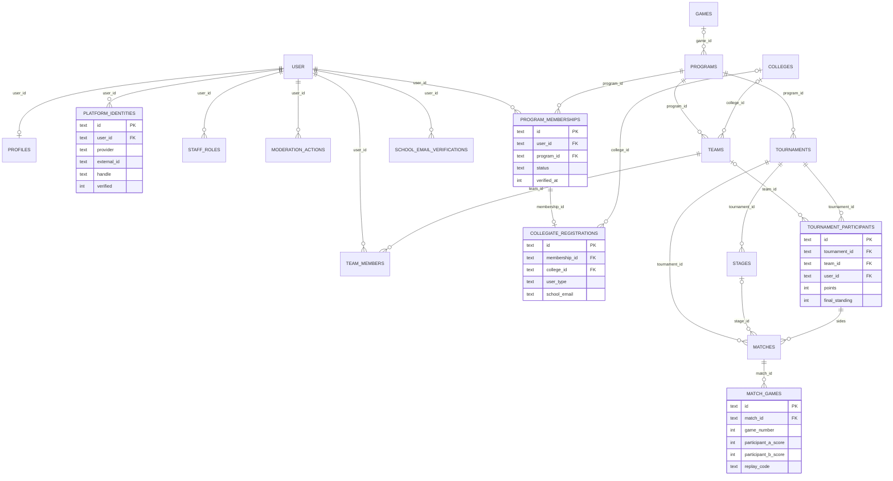
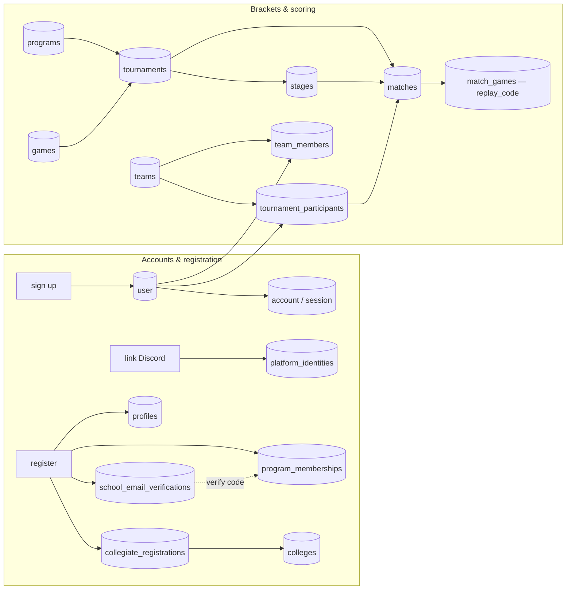

# website-sql

The Fault Foundation — application database (Cloudflare **D1 / SQLite**).

A single relational database behind the Next.js site: accounts, collegiate
membership & school-email verification, connected platform identities (Discord /
Battle.net / Steam), staff access, moderation, teams, and a **self-hosted
tournament/bracket backend** (scores + replay codes). It is built on a **stable
identity core** with **per-program satellite tables** — adding a new program is a
new table, never a change to `user`.

The source of truth is the Drizzle schema in [`db/schema.ts`](schema.ts). SQL
migrations are generated by `drizzle-kit` into [`drizzle/`](../drizzle) and
**applied by Wrangler** (which tracks applied migrations in a `d1_migrations`
table); the running app reads D1 per-request through Drizzle (`lib/db.ts`).
Better Auth owns the `user` / `session` / `account` / `verification` table shapes.

## Setup

Prerequisites: Node 20+, npm. Wrangler ships as a dev dependency. A Cloudflare D1
database is bound in [`wrangler.jsonc`](../wrangler.jsonc) as `DB`:

```jsonc
"d1_databases": [
  { "binding": "DB", "database_name": "website-sql",
    "database_id": "…", "migrations_dir": "drizzle" }
]
```

Runtime secrets live in `.dev.vars` locally / `wrangler secret put` in
production (none are needed just to build or migrate the schema):

```
BETTER_AUTH_SECRET=      # session signing
DISCORD_CLIENT_ID=       # Discord OAuth (optional; enables the "Sign in with Discord" path)
DISCORD_CLIENT_SECRET=
RESEND_API_KEY=          # school-email verification codes (omit to log codes to the terminal)
```

## Schema, migrations & seeding

```bash
npm run db:generate         # db/schema.ts change -> new SQL file in drizzle/
npm run db:migrate:local    # apply to the local D1 (.wrangler/state)
npm run db:migrate:remote   # apply to the real D1 (run before `npm run deploy`)

npm run db:seed:generate    # regenerate db/seed/schools.sql from the upstream dataset
npm run db:seed:local       # load the ~10k-row university directory
npm run db:seed:remote

# registry rows the app references by stable id (games/programs/example tournament):
wrangler d1 execute website-sql --local  --file=db/seed/bootstrap.sql
wrangler d1 execute website-sql --remote --file=db/seed/bootstrap.sql
```

**Full reset** (destructive). Migrations are additive; to rebuild from a clean
baseline, drop everything (including Wrangler's `d1_migrations` tracker) and
re-apply. Unlike a re-derivable poller cache, registration and bracket data are
operational — **back up a populated database first**:

```bash
wrangler d1 execute website-sql --remote --file=db/reset/drop-all.sql
npm run db:migrate:remote && npm run db:seed:remote
wrangler d1 execute website-sql --remote --file=db/seed/bootstrap.sql
```

Inspect any database directly:

```bash
wrangler d1 execute website-sql --local --command "SELECT name FROM sqlite_master WHERE type='table'"
```

---

# Data model

Twenty-two relations across two tiers. **Naming convention:** lean `snake_case`,
and columns are **not** table-prefixed — Better Auth fixes the `user` / `session`
/ `account` / `verification` shapes, and the app's Drizzle models read the domain
tables directly. Primary keys are application-generated **text UUIDs**
(`crypto.randomUUID()`) except `schools.id`, an integer carried from the source
dataset. Foreign keys are named `<referenced_table>_id` (`user_id`, `program_id`,
`tournament_id`, …), with a few role-qualified exceptions where a table
references the same parent twice (`captain_user_id`, `actor_user_id`,
`granted_by`, `participant_a_id` / `participant_b_id`, `winner_participant_id`,
`next_match_id`). Timestamps are **INTEGER Unix milliseconds, UTC** (Drizzle
`timestamp_ms`); booleans are `0/1` integers; JSON arrays are stored as text
(`colleges.domains`, `schools.web_pages`). Most tables carry a
`created_at` / `updated_at` pair (**omitted below for brevity**); domain-meaningful
timestamps (`verified_at`, `expires_at`, `starts_at`, `played_at`, …) are kept.

**Architecture.** Tier 1 is the **identity core**: `user` — with Better Auth's
`session` / `account` / `verification` — is the immutable anchor, and every other
table hangs off `user.id`. Tier 2 is the **program satellites**: a small
`games` / `programs` registry, a **generic** `program_memberships` join (a user's
status inside a program), and **program-specific detail in its own table**
(`collegiate_registrations` today). The extension rule that shapes the whole
schema: *a new initiative adds one `programs` row and one `<program>_details`
relation FK'd to `program_memberships` (1:1) — the identity core is never
touched.* Cross-cutting concerns are likewise their own tables, extended by row
rather than column: `platform_identities` (a new platform is a new `provider`
value), `staff_roles` (site-wide or program-scoped access), and
`moderation_actions` (append-only; `subject_*` columns outlive account deletion).
`colleges` is the durable, FK-able school entity — created on demand and deduped
by `primary_domain` — while `schools` stays a wholesale-reseeded lookup that
nothing references. The bracket backend is fully self-hosted:
`tournaments → stages → matches → match_games` (per-map scores + `replay_code`),
with `tournament_participants` that are a team **or** a solo user (a `CHECK`
enforces the exclusive-or) and single/double-elimination routing through
`matches.next_match_id`.

## Feature → schema mapping

### Authentication — Better Auth (`user` / `session` / `account` / `verification`)

| App concept | Table | Key mappings |
|---|---|---|
| Sign-up / sign-in (email + password, or Discord OAuth) | `user`, `account`, `session` | `user.email` unique; `account.provider_id` ∈ `credential` \| `discord`; the credential hash lives in `account.password`; a Discord row's `account.account_id` = the Discord user id |
| Email-change / other Better-Auth codes | `verification` | `identifier` + `value`, TTL in `expires_at` |

### Person profile & platform identities

| App concept | Table | Key mappings |
|---|---|---|
| Cross-program person record | `profiles` | 1:1 with `user`; `country`, `age_range`, `dm_preference` only |
| Connected accounts | `platform_identities` | one row per `provider`, mirrored from the Better-Auth account-created hook via `mirrorPlatformIdentity`: `discord` → `external_id` = Discord id + `handle` = display name; `battlenet` → `external_id` = Blizzard account id + `handle` = BattleTag; `steam` → `handle` = friend code. `refreshed_at` records the last provider re-read (see `loadDiscordIntegration`) — Blizzard is never re-read, since it issues no refresh token. `UNIQUE(user_id, provider)` and `UNIQUE(provider, external_id)` |

### Collegiate registration & school-email verification

| App concept | Table | Key mappings |
|---|---|---|
| Membership + review state | `program_memberships` | `status` ∈ `EMAIL_SENT` \| `MANUAL_REVIEW` \| `VERIFIED` \| `INELIGIBLE`; `UNIQUE(user_id, program_id)` |
| Program-specific detail | `collegiate_registrations` | 1:1 with the membership; `user_type`, `school_email`, `graduation_date`, `referrer`/`circumstances` (the "none of the above" path), `college_id` |
| Durable school | `colleges` | resolved via `getOrCreateCollege`, deduped by `primary_domain`; `domains`/`web_pages` JSON |
| Typeahead + domain validation | `schools` | ~10k-row reseeded directory; **nothing FKs to it** (ids only stable within one seed) |
| Verification codes | `school_email_verifications` | one active code per user; stores `sha256(userId:code)` only, plus throttle counters. A **manual-entry** school (self-supplied evidence) never auto-verifies — it routes to `MANUAL_REVIEW`; only a dataset-selected school with a trusted-domain email match issues a code |

### Staff & moderation

| App concept | Table | Key mappings |
|---|---|---|
| Extra website access | `staff_roles` | `role` ∈ `owner` \| `admin` \| `moderator` \| `tournament_admin`; `program_id` null = site-wide |
| Discipline history | `moderation_actions` | `action` ∈ `note` \| `warn` \| `kick` \| `ban`; `subject_discord_id` / `subject_email` retain anti-abuse keys after the user row is deleted |

### Teams, tournaments & scoring (self-hosted)

| App concept | Table | Key mappings |
|---|---|---|
| Roster unit | `teams` + `team_members` | college-affiliated (`college_id`) or ad-hoc; member `role`/`position`/`status`, `UNIQUE(team_id, user_id)` |
| Bracket | `tournaments` | `format` ∈ `round_robin` \| `single_elim` \| `double_elim` \| `swiss`; `status`, `best_of`, `custom_game_code` (the in-game lobby code) |
| Group / playoff phase | `stages` | `type`, `ordinal` (round-robin = one stage) |
| Competitor + standings | `tournament_participants` | team **XOR** solo user (`CHECK`); `seed`, `wins`/`losses`/`map_diff`/`points`/`final_standing` updated on confirmation |
| Match | `matches` | `status` ∈ `pending` \| `live` \| `reported` \| `confirmed` \| `disputed`; `next_match_id` + `next_match_slot` route the winner onward |
| Per-map result | `match_games` | `game_number`, `map_name`, `participant_a_score`/`_b_score`, `winner_participant_id`, **`replay_code`**; `UNIQUE(match_id, game_number)` |

## Relational function form

Relations (PK marked `*`, foreign keys marked `→` and named after the parent they
reference, `?` nullable, `UNIQUE`/`CHECK` inline). Every table also carries
`created_at`; most also `updated_at`; a few carry a single domain timestamp
instead — these bookkeeping columns are omitted below for brevity.

```
-- Tier 1 — identity core (Better Auth)
USER(            *id, name, email UNIQUE, email_verified, image? )
SESSION(         *id, user_id→USER, token UNIQUE, expires_at, ip_address?, user_agent? )
ACCOUNT(         *id, user_id→USER, provider_id, account_id, password?,
                 access_token?, refresh_token?, id_token?, scope?,
                 access_token_expires_at?, refresh_token_expires_at? )
VERIFICATION(    *id, identifier, value, expires_at )

-- Registry
GAMES(           *id, slug UNIQUE, name )
PROGRAMS(        *id, slug UNIQUE, name, description?, game_id→GAMES?, active )

-- Tier 2 — person + cross-cutting satellites (all hang off USER)
PROFILES(        *id, user_id→USER UNIQUE, country?, age_range?, dm_preference? )
PLATFORM_IDENTITIES( *id, user_id→USER, provider, external_id?, handle?, verified, connected_at?,
                 UNIQUE(user_id, provider), UNIQUE(provider, external_id) )
STAFF_ROLES(     *id, user_id→USER, role, program_id→PROGRAMS?, granted_by→USER?, granted_at,
                 UNIQUE(user_id, role, program_id) )
MODERATION_ACTIONS( *id, user_id→USER?, program_id→PROGRAMS?, action, reason?, notes?,
                 subject_discord_id?, subject_email?, actor_user_id→USER?, expires_at? )

-- Program membership + program-specific detail (the extension pattern)
PROGRAM_MEMBERSHIPS( *id, user_id→USER, program_id→PROGRAMS, status?, joined_at, verified_at?,
                 UNIQUE(user_id, program_id) )
COLLEGIATE_REGISTRATIONS( *id, membership_id→PROGRAM_MEMBERSHIPS UNIQUE, college_id→COLLEGES?,
                 user_type?, school_email?, graduation_date?, referrer?, circumstances? )
COLLEGES(        *id, name, primary_domain? UNIQUE, country?, alpha_two_code?, state_province?,
                 domains?, web_pages? )

-- Teams & rosters
TEAMS(           *id, program_id→PROGRAMS, game_id→GAMES?, college_id→COLLEGES?,
                 name, tag?, captain_user_id→USER? )
TEAM_MEMBERS(    *id, team_id→TEAMS, user_id→USER, role, position?, status, joined_at, left_at?,
                 UNIQUE(team_id, user_id) )

-- Self-hosted brackets (scores + replay codes)
TOURNAMENTS(     *id, program_id→PROGRAMS, game_id→GAMES?, name, slug UNIQUE, format, status,
                 best_of, custom_game_code?, starts_at?, ends_at?, rules_url? )
STAGES(          *id, tournament_id→TOURNAMENTS, name, type, ordinal )
TOURNAMENT_PARTICIPANTS( *id, tournament_id→TOURNAMENTS, team_id→TEAMS?, user_id→USER?,
                 seed?, checked_in_at?, wins, losses, map_diff, points, final_standing?,
                 CHECK( team_id XOR user_id ) )
MATCHES(         *id, tournament_id→TOURNAMENTS, stage_id→STAGES?, round?, bracket?,
                 participant_a_id→TOURNAMENT_PARTICIPANTS?, participant_b_id→TOURNAMENT_PARTICIPANTS?,
                 winner_participant_id→TOURNAMENT_PARTICIPANTS?, best_of, status,
                 scheduled_at?, played_at?, next_match_id→MATCHES?, next_match_slot? )
MATCH_GAMES(     *id, match_id→MATCHES, game_number, map_name?, mode?,
                 participant_a_score, participant_b_score,
                 winner_participant_id→TOURNAMENT_PARTICIPANTS?, replay_code?,
                 UNIQUE(match_id, game_number) )

-- Reference / registration support
SCHOOLS(         *id, name, country, alpha_two_code, state_province?, domains, web_pages )
SCHOOL_EMAIL_VERIFICATIONS( *id, user_id→USER UNIQUE, email, code_hash, expires_at,
                 attempts, send_count, first_sent_at, last_sent_at, verified_at? )
```

Functional dependencies (identity + natural / unique keys):

```
id                                            → all attributes of its relation   (every table)
user.email                                    → user.id           (UNIQUE)
session.token                                 → session.id        (UNIQUE)
programs.slug / games.slug / tournaments.slug → that relation's id (UNIQUE)
profiles.user_id                              → profiles.id       (1:1 with user)
(platform_identities.user_id, provider)       → platform_identities.id
(platform_identities.provider, external_id)   → platform_identities.id
(program_memberships.user_id, program_id)     → program_memberships.id
collegiate_registrations.membership_id        → collegiate_registrations.id   (1:1 with membership)
school_email_verifications.user_id            → school_email_verifications.id (one active code / user)
colleges.primary_domain                       → colleges.id
(team_members.team_id, user_id)               → team_members.id
(match_games.match_id, game_number)           → match_games.id
```

Entity navigation as total (→) / partial (⇀) functions, plus relations (⊆) and
one exclusive-or (⊕):

```
owner      : PROFILES / PLATFORM_IDENTITIES / PROGRAM_MEMBERSHIPS / STAFF_ROLES /
             TEAM_MEMBERS / SCHOOL_EMAIL_VERIFICATIONS → USER
program    : PROGRAM_MEMBERSHIPS / TEAMS / TOURNAMENTS → PROGRAMS   (STAFF_ROLES ⇀ PROGRAMS)
game       : PROGRAMS / TEAMS / TOURNAMENTS ⇀ GAMES
detail     : PROGRAM_MEMBERSHIPS ↔ COLLEGIATE_REGISTRATIONS        (1:1 — the program-specific extension)
college    : COLLEGIATE_REGISTRATIONS / TEAMS ⇀ COLLEGES
tournament : STAGES / TOURNAMENT_PARTICIPANTS / MATCHES → TOURNAMENTS
stage      : MATCHES ⇀ STAGES
match      : MATCH_GAMES → MATCHES
sides      : MATCHES ⇀ TOURNAMENT_PARTICIPANTS × TOURNAMENT_PARTICIPANTS   (a, b, winner)
competitor : TOURNAMENT_PARTICIPANTS → TEAMS ⊕ USER                        (exactly one; CHECK)
roster     ⊆ TEAMS × USER                                                  (many-to-many via TEAM_MEMBERS)
advance    : MATCHES ⇀ MATCHES                                             (winner routing via next_match_id)

-- a member's full record is the fan-out from USER; a new program P adds a row to
-- PROGRAMS and a relation  P_DETAILS → PROGRAM_MEMBERSHIPS (1:1), exactly as
-- COLLEGIATE_REGISTRATIONS does, without touching USER or its other satellites.
```

## Graph view

Entity-relationship graph (Mermaid):



Data-flow graph — how the app's surfaces write into the shared schema:



## Hierarchical views

A member's record — everything fans out from one `user` row:

```
User  (Better Auth: + session, account, verification)
├─ Profile             country, age range, dm pref                     1:1
├─ Platform Identity   discord / battlenet / steam                     0..n
├─ Staff Role          owner / admin / moderator / tournament_admin    0..n
├─ Program Membership  status (per program)                            0..n
│  └─ Collegiate Registration  school email, grad date ─→ College      1:1 detail
├─ Team Membership     role, position ─→ Team ─→ College               0..n
└─ Moderation Action   note / warn / kick / ban                        0..n
```

A tournament — the self-hosted bracket tree:

```
Program  (+ Game)
└─ Tournament   format, status, best_of, custom_game_code
   ├─ Stage     round_robin / single_elim / double_elim / swiss
   │  └─ Match  round, status, next_match ──▶ advance winner
   │     └─ Match Game   map, scores, replay_code
   └─ Participant   team XOR solo user; seed, wins/losses, standing
      └─ Team ─→ Roster  (Team Members ─→ Users)
```

---

## Surface & status

| Area | Tables | Status |
|---|---|---|
| Accounts & auth | `user`, `session`, `account`, `verification` | **Live** — email/password + Discord OAuth (Better Auth) |
| Profile & identities | `profiles`, `platform_identities` | **Live** — Discord mirrored; Battle.net / Steam schema-ready (OAuth TODO) |
| Collegiate registration | `program_memberships`, `collegiate_registrations`, `colleges`, `schools`, `school_email_verifications` | **Live** — school-email verification; manual path routes to human review |
| Staff & moderation | `staff_roles`, `moderation_actions` | Schema-ready, no UI yet |
| Teams & rosters | `teams`, `team_members` | Schema-ready, no UI yet |
| Brackets & scoring | `tournaments`, `stages`, `tournament_participants`, `matches`, `match_games` | Schema-ready (self-hosted), no UI yet |
| Reference data | `games`, `programs` | Seeded via `db/seed/bootstrap.sql` (`overwatch`, `collegiate-overwatch`) |

Schema source of truth: [`db/schema.ts`](schema.ts). Baseline migration:
[`drizzle/`](../drizzle). Full rebuild: [`db/reset/drop-all.sql`](reset/drop-all.sql)
+ [`db/seed/bootstrap.sql`](seed/bootstrap.sql).
